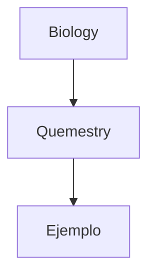
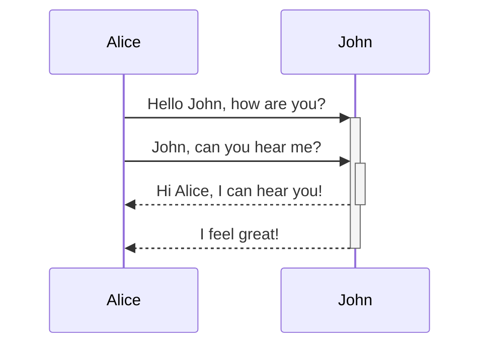

#Obsidian 
Diagramas

Puedes hacer algunos diagramas y mencionar otras notas:

```mermaid
graph TD

Biology --> Quemestry --> Ejemplo
```

Diagrama con direcciones (Dirige una conversación):

```mermaid
sequenceDiagram
    Alice->>+John: Hello John, how are you?
    Alice->>+John: John, can you hear me?
    John-->>-Alice: Hi Alice, I can hear you!
    John-->>-Alice: I feel great!
    
```

